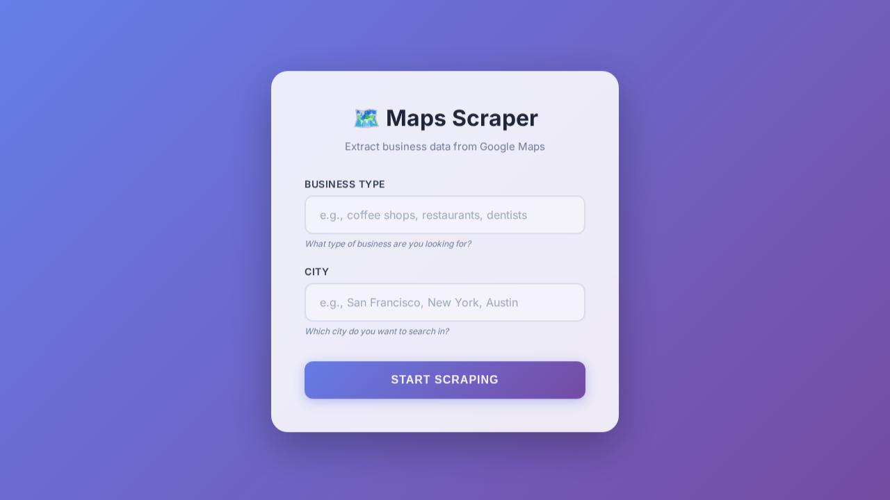

# Google Maps Scraper

A Node.js scraper using Playwright to extract comprehensive business information from Google Maps.

## Features

- **Basic Info**: Name, Address, Phone, Website, Rating, Review Count
- **Reviews**: Extracts up to 10 reviews per business with full expanded text
- **Review Categories**: Formatted as `subject (count)` - e.g., "questions (11)", "knowing (4)"
- **Mentioned Names**: Extracts human first+last names from reviews
- **Emails**: Visits business websites and extracts emails

## Technologies & APIs Used

This project does **not** use the official Google Maps API. Instead, it uses browser automation to scrape data directly from the web interface.

- **[Playwright](https://playwright.dev/)**: Used for browser automation to navigate Google Maps, scroll through results, and extract data from the DOM.
- **Node.js**: The runtime environment for the scraper.
- **csv-writer**: Used to generate the CSV output file.
- **Google Search**: Used as a fallback to verify if a business has a website when one is not listed on Maps.

## Screenshots



## Installation

```bash
npm install
```

## Usage

```bash
node scraper.js "your search query"
```

Example:

```bash
node scraper.js "bookkeepers in Dallas Fort Worth"
```

## Output

Results are saved to:

- `results.csv` - CSV format with all extracted data
- `results.json` - JSON format with detailed information

## Sample Data

```json
[
  {
    "name": "Example Business",
    "address": "123 Main St, City, ST 12345",
    "phone": "(555) 123-4567",
    "website": "https://example.com",
    "rating": "4.8",
    "reviewCount": "150",
    "reviews": [
      {
        "reviewer": "John Doe",
        "rating": "5 stars",
        "text": "Great service!",
        "time": "2 months ago"
      }
    ],
    "reviewCategories": ["quality (15)", "price (10)"],
    "mentionedNames": ["Alice", "Bob"],
    "email": "contact@example.com"
  }
]
```

## Configuration

- `MAX_RESULTS`: Currently set to 10 for testing (line 6 in scraper.js)
- Review limit: 10 reviews per business (line 249 in scraper.js)

## CSV Columns

- Name
- Address
- Phone
- Website
- Rating
- Review Count
- Mentioned in # of Reviews (formatted as "subject (count)")
- Mentioned Names (human first+last names)
- Email
- URL

## Next Steps

- **Pagination**: Support for scraping more than 10 results (currently limited for testing).
- **Headless Mode**: Add configuration to run the browser in headless mode for faster execution.
- **Database Storage**: Integrate SQLite or PostgreSQL to store results directly instead of JSON/CSV files.
- **Proxy Support**: Add proxy rotation to handle large-scale scraping without IP blocks.
- **Dockerization**: Containerize the application for easier deployment and dependency management.
